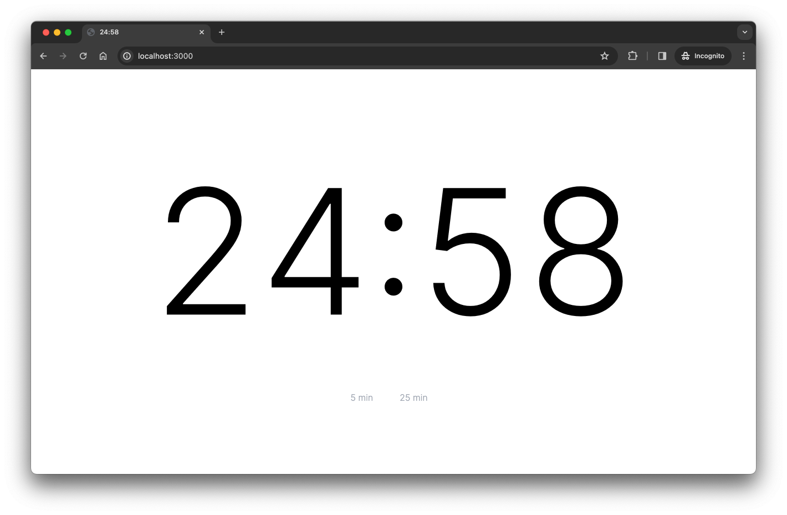

# Timer

The most minimalist timer ever existed.

## How to use it

1. Add time +5...
2. Start: click on time
3. Restart: click on time

## As "standalone" Chrome app...

1. Open [https://timer.singuerinc.com/](https://timer.singuerinc.com/) in Chrome
2. Click on the tree dots (up-right)
3. More tools > Create shortcut... > Open as window > Create
4. Open Timer
